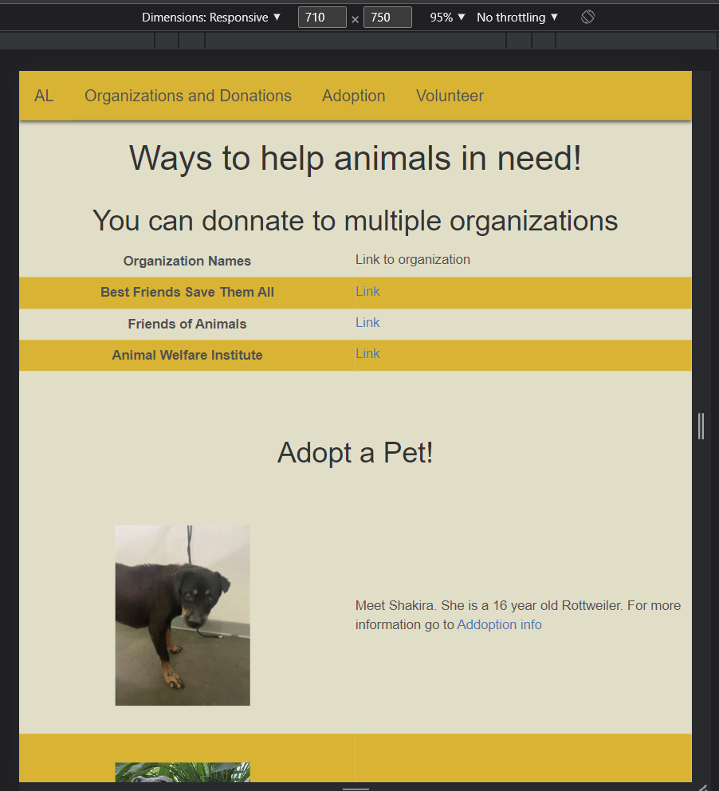
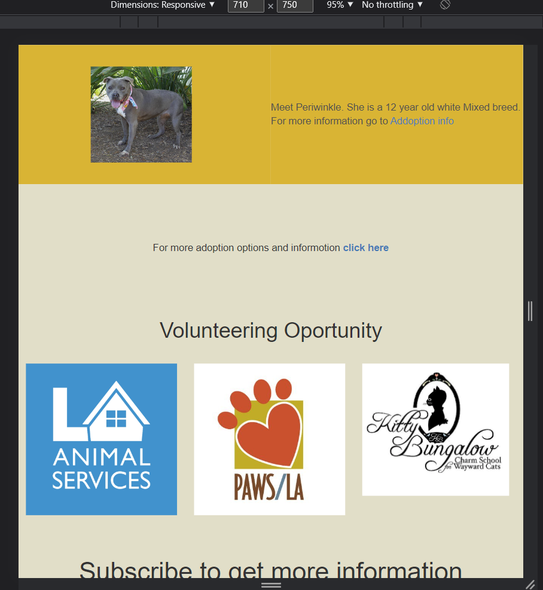
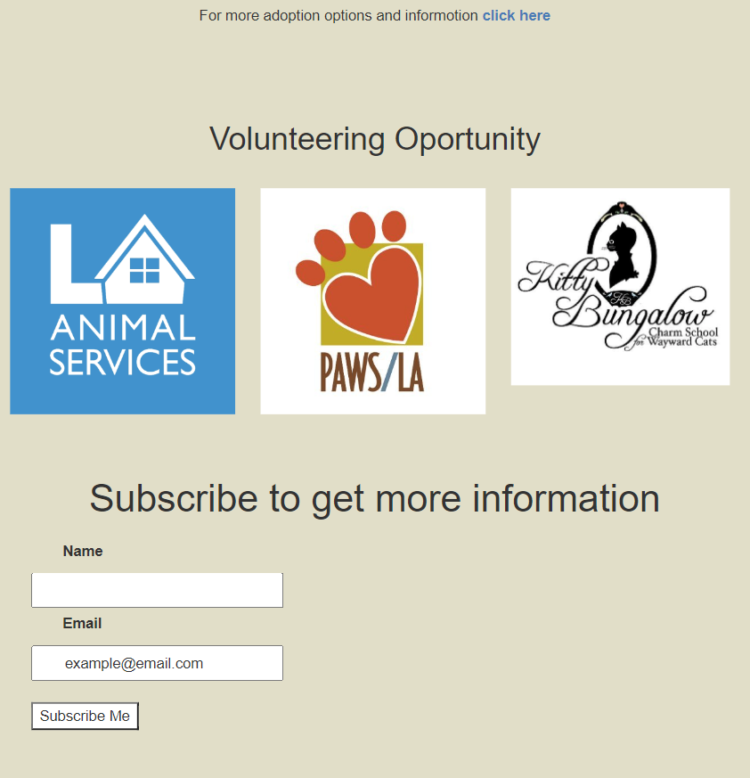

# My webpage 
 - Theme idea: Help animals in anyway you can 

## Requirement inputed 
- HTML tags used 
    - div, img, a, span, table, tr, th, td, section, br, form, label, input, button

- Tables
    - Two tables, for organizations name section and adoption section.

- Form 
    - Bottom of page, users option to subscribe 

- Styles 
    - font-family, overflow, backgorund-color, box-shadow, float, color, text-align,
      padding(top, bottom, right, left), text-decoration, font-size, display, hover,
      nth-child, flex-wrap, column-gap, row-gap, active

- Website desgin principles 
    - topnav -> for users to have the option to go directly what section of the page
      they wish to go to. 
    - grif-layout -> webpage is manageable for new users, everything should be direct. 
    - mobile friendly -> accesible to any device. 

### preview 

